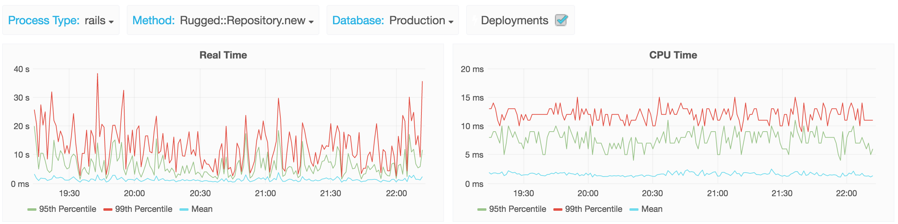

# Gitaly

- [What](#what)
- [Name](#name)
- [Reason](#reason)
- [Decisions](#decisions)
- [Iterate](#iterate)
- [Plan](#plan)

## What

Gitaly is a daemon handles all the git calls made by GitLab.

To see where it fits in please look at [GitLab's architecture](https://docs.gitlab.com/ce/development/architecture.html#system-layout)

## References

- [GitHub diff pages](http://githubengineering.com/how-we-made-diff-pages-3x-faster/)
- [Bitbucket adaptive throttling](https://developer.atlassian.com/blog/2016/12/bitbucket-adaptive-throttling/)
- [Bitbucket caches](https://developer.atlassian.com/blog/2016/12/bitbucket-caches/)
- [GitHub Dgit (later Spokes)](http://githubengineering.com/introducing-dgit/)
- [GitHub Spokes (former Dgit)](http://githubengineering.com/building-resilience-in-spokes/)
- [Git Ketch](https://dev.eclipse.org/mhonarc/lists/jgit-dev/msg03073.html)
- [Lots of thinking in issue 2](https://gitlab.com/gitlab-org/gitaly/issues/2)
- [Git Pack Protocol Reference](https://github.com/git/git/blob/master/Documentation/technical/pack-protocol.txt)
- [Git Transfer Protocol internals](https://git-scm.com/book/en/v2/Git-Internals-Transfer-Protocols)
- [E3 Elastic Experiment Executor](https://bitbucket.org/atlassian/elastic-experiment-executor)

## Name

Gitaly is a tribute to git and the town of [Aly](https://en.wikipedia.org/wiki/Aly). Where the town of
Aly has zero inhabitants most of the year we would like to reduce the number of
disk operations to zero for most actions. It doesn't hurt that it sounds like
Italy, the capital of which is [the destination of all roads](https://en.wikipedia.org/wiki/All_roads_lead_to_Rome). All git actions in
GitLab end up in Gitaly.

## Reason

For GitLab.com the [git access is slow](https://gitlab.com/gitlab-com/infrastructure/issues/351).

When looking at `Rugged::Repository.new` performance data we can see that our P99 spikes up to 30 wall seconds, while the CPU time keeps in the realm of the 15 milliseconds. Pointing at filesystem access as the culprit.

Our P99 access time to just create a Rugged::Repository object, which is loading and processing the git objects from disk, spikes over 30 seconds, making it basically unusable. We also saw that just walking through the branches of gitlab-ce requires 2.4 wall seconds.

We considered to move to metal to fix our problems with higher performaning hardware. But our users are using GitLab in the cloud so it should work great there. And this way the increased performance will benefit every GitLab user.

Gitaly will make our situation better in a few steps:

1. One central place to monitor operations
1. Performance improvements doing less and caching more
1. Move the git operations from the app to the file/git server with git rpc (routing git access over JSON HTTP calls)
1. Use Git ketch to allow active-active (push to a local server), and distributed read operations (read from a secondary).

## Decisions

All design decision should be added here.

1. Why are we considering to use Git Ketch? It is open source, uses the git protocol itself, is made by experts in distributed systems (Google), and is as simple as we can think of. We have to accept that we'll have to run the JVM on the Git servers.
1. We'll keep using the existing sharding functionality in GitLab to be able to add new servers. Currently we can use it to have multiple file/git servers. Later we will need multiple Git Ketch clusters.
1. We need to get rid of NFS mounting at some point because one broken NFS server causes all the application servers to fail to the point where you can't even ssh in.
1. We want to move the git executable as close to the disk as possible to reduce latency, hence the need for git rpc to talk between the app server and git.
1. [Cached metadata is stored in Redis LRU](https://gitlab.com/gitlab-org/gitaly/issues/2#note_20157141)
1. [Cached payloads are stored in files](https://gitlab.com/gitlab-org/gitaly/issues/14) since Redis can't store large objects
1. Why not use GitLab Git? So workhorse and ssh access can use the same system. We need this to manage cache invalidation.
1. Why not make this a library for most users instead of a daemon/server? If it is a library it is hard to do in memory caching, and we will still need to keep the NFS shares mounted in the application hosts.
1. Can we focus on instrumenting first before building Gitaly? Prometheus doesn't work with Unicorn.
1. How do we ship this quickly without affecting users? Behind a feature flag like we did with workhorse. We can update it independently in production.
1. How much memory will this use? Guess 50MB, we will save memory in the rails app, guess more in sidekiq (GBs but not sure), but initially more because more libraries are still loaded everywhere.
1. What will we use for git rpc? JSON over HTTP initially to keep it simple. If measurements show out it isn't fast enough we can switch to a binary protocol. But binary protocols slow down iteration and debugging.
1. What packaging tool do we use? [Govendor because we like it more](https://gitlab.com/gitlab-org/gitaly/issues/15)
1. How will the networking work? A unix socket for git operations and TCP for monitoring. This prevents having to build out authentication at this early stage. https://gitlab.com/gitlab-org/gitaly/issues/16
1. We'll include the /vendor directory in source control https://gitlab.com/gitlab-org/gitaly/issues/18
1. Use gitaly-client or HTTP/websocket clients? gitlab-shell copies the SSH stream, both ways, to gitaly over a websocket, workhorse just forwards the request to Gitaly, let’s use HTTP. https://gitlab.com/gitlab-org/gitaly/issues/5#note_20294280
1. We will use [E3 from BitBucket to measure performance closely in isolation](https://gitlab.com/gitlab-org/gitaly/issues/34).

## Iterate

Instead of moving everything to Gitaly and only than optimize performance we'll iterate so we quickly have results

The iteration process is as follows

1. Move a specific set of functions without modification
1. Measure their performance
1. Try to improve the performance by reducing reads and/or caching
1. Measure the effect

Some examples of a specific set of functions:

- The initial one is discussed in https://gitlab.com/gitlab-org/gitaly/issues/13
- File cache for Git HTTP GET /info/refs https://gitlab.com/gitlab-org/gitaly/issues/17
- Getting the “title” of a commit so we can use it for Markdown references/links
- Loading a blob for syntax highlighting
- Getting statistics (branch count, tag count, etc), ideally without loading all kinds of Git references (which currently happens)
- Checking if a blob is binary, text, svg, etc
- Blob cache seems complicated https://gitlab.com/gitlab-org/gitaly/issues/14

## Plan

We use our issues board for keeping our work in progress up to date in a single place. Please refer to it to see the current status of the project.

1. [Move gitlab_git into GitLab so we don’t support 2 external things for working with git?](https://gitlab.com/gitlab-org/gitlab-ce/issues/24374)
1. [Milestone 0.0.1](https://gitlab.com/gitlab-org/gitaly/milestones/2)
1. [Move more functions in accordance with the iterate process, starting with the ones with have the highest impact.](https://gitlab.com/gitlab-org/gitaly/issues/13)
1. [Move to Git RPC, we should already have Gitaly calls everywhere but move from a local socket to non-local one.](https://gitlab.com/gitlab-org/gitaly/issues/30)
1. [Move Gitaly where the file servers that become git servers, halving the amount of IOPS, reducing latency greatly, and allowing workers to keep serving requests.](https://gitlab.com/gitlab-org/gitaly/issues/26)
1. [No longer mount the NFS shares](https://gitlab.com/gitlab-org/gitaly/issues/27)
1. [Remove gitlab git from Gitlab Rails](https://gitlab.com/gitlab-org/gitaly/issues/31)
1. [Move to active-active with Git Ketch, with this we can read from any node, greatly reducing the number of IOPS on the leader.](https://gitlab.com/gitlab-org/gitlab-ee/issues/1381)
1. [Move to the most performant and cost effective cloud](https://gitlab.com/gitlab-com/infrastructure/issues/934)
