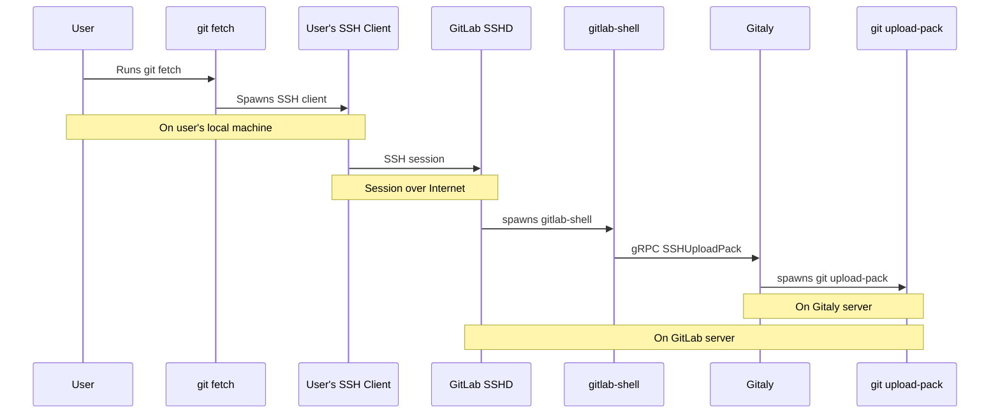
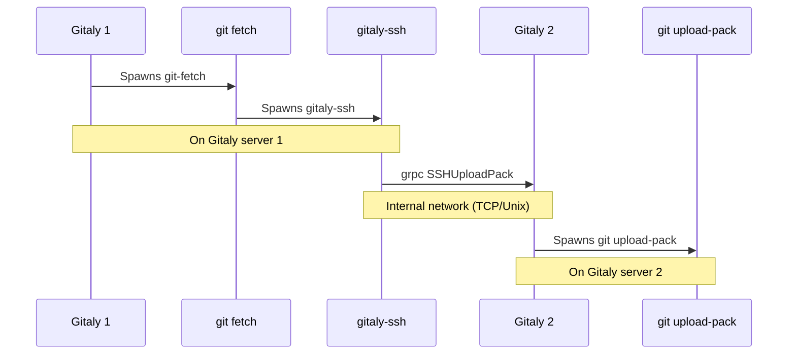

# gitaly-ssh

Gitaly-ssh is a helper executable that enables Git data traffic
(`git fetch`) between Gitaly servers within a single GitLab
installation. It acts as a plugin to `git fetch` using the
`GIT_SSH_COMMAND` environment variable.

We created gitaly-ssh because we needed a way to pull Git data from one
Gitaly server to another, without going through one of the "front
doors" of GitLab: gitlab-shell (Git SSH) or gitlab-workhorse (Git
HTTP). To avoid building a special RPC for this, we re-used the
SSHUploadPack RPC that Gitaly already had. By connecting directly to
the Gitaly server we avoided the need to create some kind of service
account in GitLab itself: to go through the front door we would need a
service account.

The implementation shares code with how gitlab-shell handles Git SSH traffic
from real users, but it cuts out SSH itself.

> Note for Git experts: in retrospect, we should have used
[git-remote-ext](https://git-scm.com/docs/git-remote-ext) for this,
but we didn't know that mechanism existed at the time.

## How gitlab-shell does it

A normal `git fetch` over SSH goes through these steps. Note that here
`git fetch` runs on the computer of a GitLab user.

## How gitaly-ssh does it

In contrast, with `gitaly-ssh`, `git fetch` is run by one Gitaly server
('gitaly 1') that wants to fetch data from another ('gitaly 2'). Note
that there is no SSH client or server in this chain.

