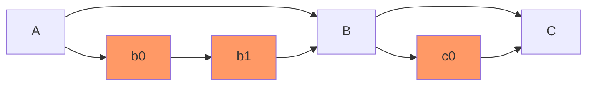
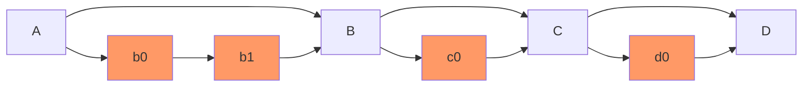
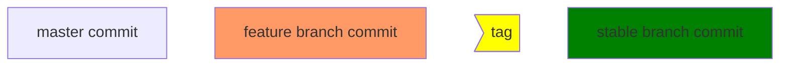

## Gitaly Team Process

### Feature flags

Gitaly uses feature flags to safely roll out features in production. Feature
flags are part of the `context.Context` of each RPC. The `featureflag` package
will help you with flow control.

Feature flags are [enabled through chatops][enable-flags]. For Gitaly, you have
to prepend `gitaly_` to your feature flag when enabling or disabling. For example:
to enable the feature flag "mep_mep", you run:

`/chatops run feature set gitaly_mep_mep true`

For customers, who don't use chatops, an [HTTP API is available][ff-api].

[enable-flags]: https://docs.gitlab.com/ee/development/feature_flags/controls.html
[ff-api]: https://docs.gitlab.com/ee/api/features.html#features-flags-api

### Gitaly Releases

Gitaly releases are tagged automatically by [`release-tools`](https://gitlab.com/gitlab-org/release-tools) when a Release Manager tags a GitLab version.

#### Major or minor releases

Once we release GitLab X.Y.0, we also release gitaly X.Y.0 based on the content of `GITALY_SERVER_VERSION`.
This version file is automatically updated by `release-tools` during auto-deploy picking.

Because gitaly master is moving we need to take extra care of what we tag.

Let's imagine a situation like this on `master`

Commit `C` is picked into auto-deploy and the build is successfully deployed to production

We are ready to tag `v12.9.0` but there is a new merge commit, `D`, on gitaly `master`.

We cannot tag on `D` as it never reached production.

`release-tools` follows this algoritm:
1. create a stable branch from `GITALY_SERVER_VERSION` (commit `C`),
1. bump the version and
1. prepare the changelog (commit `C'`).

Then we tag this commit and we merge back to `master`

Legend

With this solution, the team can autonomously tag any RC they like, but the other releases are handled by the GitLab tagging process.

#### Patch releases

The Gitaly team usually works on patch releases in the context of a security release.

The release automation creates the stable branches, tagging the stable branch is automated in `release-tools` as well.
A Gitaly maintainer will only take care of merging the fixes on the stable branch.

For patch releases, we don't merge back to master. But `release-tools` will commit a changelog update to both the patch release, and the master branch.

#### Creating a release candidate

Release candidate (RC) can be created with a chatops command.
This is the only type of release that a developer can build autonomously.

When working on a GitLab feature that requires a minimum gitaly version,
tagging a RC is a good way to make sure the gitlab feature branch has the proper gitaly version.

- Pick the current milestone (i.e. 12.9)
- Pick a release candidate number, you can check `VERSION` to see if we have one already (12.9.0-rc1)
- run `/chatops run gitaly tag 12.9.0-rc1`
- The release will be published
- The [pipeline of a tag](https://gitlab.com/gitlab-org/gitaly/pipelines?scope=tags&page=1)
  has a **manual** job, `update-downstream-server-version`, that will create a merge request on the GitLab codebase to bump the Gitaly server version, and this will be assigned to you. 
  Once the build has completed successfully, assign it to a maintainer for review.

### Publishing the ruby gem

If an updated version of the ruby proto gem is needed, it can be published to rubygems.org with the `_support/publish-gem` script.

If the changes needed are not yet released, [create a release candidate](#creating-a-release-candidate) first.

- Checkout the tag to publish (vX.Y.Z)
- run `_support/publish-gem X.Y.Z`

##### Security release

Security releases involve additional processes to ensure that recent releases
of GitLab are properly patched while avoiding the leaking of the security
details to the public until appropriate.

Before beginning work on a security fix, open a new Gitaly issue with the template
`Security Release` and follow the instructions at the top of the page for following
the template.

## Experimental builds

Push the release tag to dev.gitlab.org/gitlab/gitaly. After
passing the test suite, the tag will automatically be built and
published in https://packages.gitlab.com/gitlab/unstable.
