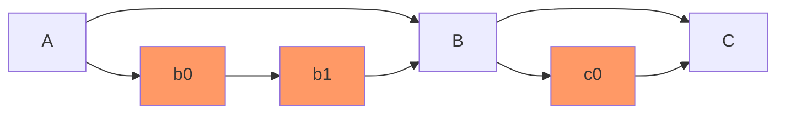
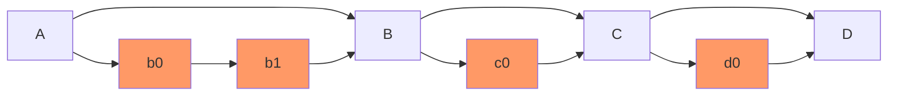
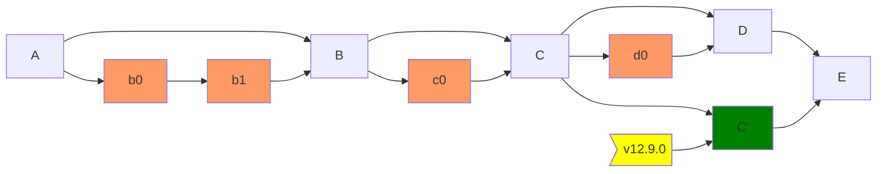

## Gitaly Team Process

### Feature flags

Gitaly uses feature flags to safely roll out features in production. Feature
flags are part of the `context.Context` of each RPC. The `featureflag` package
will help you with flow control.

Most of this documentation assumes operations on `gitlab.com`. For
customers, an [HTTP API is available][ff-api].

In order to roll out feature flags to `gitlab.com`, you should follow
the documented rollout process below.

Once you have [developed your feature][feature-development] you [start
by creating an issue for the rollout][issue-for-feature-rollout].

The "Feature Flag Roll Out" [template for the
issue][feature-issue-template] has a checklist for the rest of the
steps.

[ff-api]: https://docs.gitlab.com/ee/api/features.html#features-flags-api
[feature-development]: https://docs.gitlab.com/ee/development/feature_flags/index.html
[issue-for-feature-rollout]: https://gitlab.com/gitlab-org/gitaly/-/issues/new?issuable_template=Feature%20Flag%20Roll%20Out
[feature-issue-template]: https://gitlab.com/gitlab-org/gitaly/-/blob/master/.gitlab/issue_templates/Feature%20Flag%20Roll%20Out.md

#### Use and limitations

Feature flags are [enabled through chatops][enable-flags] (which is
just a consumer [of the API][ff-api]). In
[`#chat-ops-test`][chan-chat-ops-test] try:

    /chatops run feature list --match gitaly_

If you get a permission error you need to request access first. That
can be done [in the `#production` channel][production-request-acl].

For Gitaly, you have to prepend `gitaly_` to your feature flag when
enabling or disabling. For example: to check if
[`gitaly_go_user_delete_tag`][chan-production] is enabled on staging
run:

    /chatops run feature get gitaly_go_user_delete_tag --staging

Note that the full set of chatops features for the Rails environment
does not work in Gitaly. E.g. the [`--user` argument does
not][bug-user-argument], neither does [enabling by group or
project][bug-project-argument].

[enable-flags]: https://docs.gitlab.com/ee/development/feature_flags/controls.html
[chan-chat-ops-test]: https://gitlab.slack.com/archives/CB2S7NNDP
[production-request-acl]: https://gitlab.slack.com/archives/C101F3796
[chan-production]: https://gitlab.com/gitlab-org/gitaly/-/issues/3371
[bug-user-argument]: https://gitlab.com/gitlab-org/gitaly/-/issues/3385
[bug-project-argument]: https://gitlab.com/gitlab-org/gitaly/-/issues/3386

### Feature flags issue checklist

The rest of this section is help for the individual checklist steps in
[the issue template][feature-issue-template]. If this is your first
time doing this you might want to first skip ahead to the help below,
you'll likely need to file some access requests.

#### Is the required code deployed?

The [/help action on gitlab.com][help-action] shows the currently
deployed hash. Copy that `HASH` and look at `GITALY_SERVER_VERSION` in
[gitlab-org/gitlab.git][gitlab-git] to see what the embedded gitaly
version is. Or in [a gitaly.git checkout][gitaly-git] run this to see
what commits aren't deployed yet:

    git fetch
    git shortlog $(curl -s https://gitlab.com/gitlab-org/gitlab/-/raw/HASH/GITALY_SERVER_VERSION)..origin/master

See the [documentation on releases below](#gitaly-releases) for more
details on the tagging and release process.

[help-action]: https://gitlab.com/help
[gitlab-git]: https://gitlab.com/gitlab-org/gitlab/
[gitaly-git]: https://gitlab.com/gitlab-org/gitaly/

#### Enable on staging

##### Prerequisites

You'll need chatops access. See [above](#use-and-limitations).

##### Steps

Run:

`/chatops run feature set gitaly_X true --staging`

Where `X` is the name of your feature.

#### Test on staging

##### Prerequisites

Access to https://staging.gitlab.com/users is not the same as on
gitlab.com (or signing in with Google on the @gitlab.com account). You
must [request access to it][staging-access-request].

As of December 2020 clicking "Sign in" on
https://about.staging.gitlab.com will redirect to https://gitlab.com,
so make sure to use the `/users` link.

[staging-access-request]: https://gitlab.com/gitlab-com/team-member-epics/access-requests/-/issues/new?issuable_template=Individual_Bulk_Access_Request

##### Steps

Manually use the feature in whatever way exercises the code paths
being enabled.

Then enable `X` on staging, with:

     /chatops run feature set gitaly_X --staging

##### Discussion

It's a good idea to run the feature for a full day on staging, this is
because there are daily smoke tests that run daily in that
environment. These are handled by
[gitlab-org/gitlab-qa.git][gitlab-qa-git]

[gitlab-qa-git]: https://gitlab.com/gitlab-org/gitlab-qa#how-do-we-use-it

#### Enable in production

##### Prerequisites

Have you waited enough time with the feature running in the staging
environment? Good!

##### Steps

To enable your `X` feature at 5/25/50 percent, run:

    /chatops run feature set gitaly_X 5
    /chatops run feature set gitaly_X 25
    /chatops run feature set gitaly_X 50

And then finally when you're happy it works properly do:

    /chatops run feature set gitaly_X 100

Followed by:

    /chatops run feature set gitaly_X true

Note that you need both the `100` and `true` as separate commands. See
[the documentation on actor
gates][actor-gates]

[actor-gates]: https://docs.gitlab.com/ee/development/feature_flags/controls.html#process

##### Discussion

What percentages should you pick and how long should you wait?

It makes sense to be aggressive about getting to 50% and then 100% as
soon as possible.

You should use lower percentages only as a paranoia check to make sure
that it e.g. doesn't spew errors at users unexpectedly at a high rate,
or (e.g. if it invokes a new expensive `git` command) doesn't create
runaway load on our servers.

But say running at 5% for hours after we've already had sufficient
data to demonstrate that we won't be spewing errors or taking down the
site just means you're delaying getting more data to be certain that
it works properly.

Nobody's better off if you wait 10 hours at 1% to get error data you
could have waited 1 hour at 10% to get, or just over 10 minutes with
close monitoring at 50%.

### Gitaly Releases

Gitaly releases are tagged automatically by
[`release-tools`][release-tools] when a Release Manager tags a GitLab
version.

[release-tools]: https://gitlab.com/gitlab-org/release-tools

#### Major or minor releases

Once we release GitLab X.Y.0, we also release gitaly X.Y.0 based on the content of `GITALY_SERVER_VERSION`.
This version file is automatically updated by `release-tools` during auto-deploy picking.

Because gitaly master is moving we need to take extra care of what we tag.

Let's imagine a situation like this on `master`

Commit `C` is picked into auto-deploy and the build is successfully deployed to production

We are ready to tag `v12.9.0` but there is a new merge commit, `D`, on gitaly `master`.

We cannot tag on `D` as it never reached production.

`release-tools` follows this algorithm:
1. create a stable branch from `GITALY_SERVER_VERSION` (commit `C`),
1. bump the version and
1. prepare the changelog (commit `C'`).

Then we tag this commit and we merge back to `master`

Legend

With this solution, the team can autonomously tag any RC they like, but the other releases are handled by the GitLab tagging process.

#### Patch releases

The Gitaly team usually works on patch releases in the context of a security release.

The release automation creates the stable branches, tagging the stable branch is automated in `release-tools` as well.
A Gitaly maintainer will only take care of merging the fixes on the stable branch.

For patch releases, we don't merge back to master. But `release-tools` will commit a changelog update to both the patch release, and the master branch.

#### Creating a release candidate

Release candidate (RC) can be created with a chatops command.
This is the only type of release that a developer can build autonomously.

When working on a GitLab feature that requires a minimum gitaly version,
tagging a RC is a good way to make sure the gitlab feature branch has the proper gitaly version.

- Pick the current milestone (i.e. 12.9)
- Pick a release candidate number, you can check `VERSION` to see if we have one already (12.9.0-rc1)
- run `/chatops run gitaly tag 12.9.0-rc1`
- The release will be published
- The [pipeline of a tag](https://gitlab.com/gitlab-org/gitaly/pipelines?scope=tags&page=1)
  has a **manual** job, `update-downstream-server-version`, that will create a merge request on the GitLab codebase to bump the Gitaly server version, and this will be assigned to you.
  Once the build has completed successfully, assign it to a maintainer for review.

### Publishing the ruby gem

If an updated version of the ruby proto gem is needed, it can be published to rubygems.org with the `_support/publish-gem` script.

If the changes needed are not yet released, [create a release candidate](#creating-a-release-candidate) first.

- Checkout the tag to publish (vX.Y.Z)
- run `_support/publish-gem X.Y.Z`

##### Security release

Security releases involve additional processes to ensure that recent releases
of GitLab are properly patched while avoiding the leaking of the security
details to the public until appropriate.

Before beginning work on a security fix, open a new Gitaly issue with the template
`Security Release` and follow the instructions at the top of the page for following
the template.

## Experimental builds

Push the release tag to dev.gitlab.org/gitlab/gitaly. After
passing the test suite, the tag will automatically be built and
published in https://packages.gitlab.com/gitlab/unstable.
