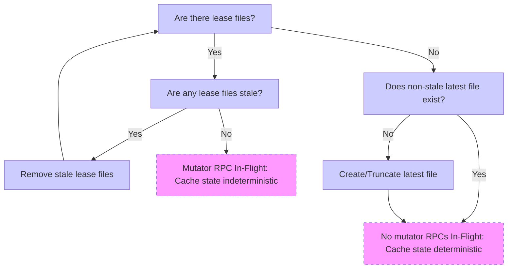

# Disk Cache Design

Gitaly utilizes a disk-based cache for efficiently serving some RPC responses
(at time of writing, only the `SmartHTTPService.InfoRefUploadPack` RPC). This
cache is intended to be used for serving large responses not suitable for a RAM
based cache.

## Cache Invalidation

The mechanisms that enable the invalidation of the disk cache for a repo depend
on special annotations made to the Gitaly gRPC methods. Each method that has
scope "repository" and is operation type "mutator" will cause the specified
repository to be invalidated. For more information on the annotation system,
see the Gitaly protobuf definition [contributing guide].

[contributing guide]: https://gitlab.com/gitlab-org/gitaly/tree/4c27a7f71ba1d91edbc9d321919620887d6a30d3/proto#rpc-annotations

## Repository State

For every repository using the disk cache, a special set of files is maintained
to indicate which cached responses are still valid. These files are stored
in a dedicated **state directory** for each repository:

	${STATE_DIR} = ${STORAGE_PATH}/+gitaly/state/${REPO_RELATIVE_PATH}

Before a mutating RPC handler is invoked, a gRPC middleware creates a "lease"
file in the state directory that signifies a mutating operation is in-flight.
These lease files reside at the following path:

	${STATE_DIR}/pending/${RANDOM_FILENAME}

Upon the completion of the mutating RPC, the lease file will be removed and
the "latest" file will be updated with a random value to reflect the new
"state" of the repository.

	${STATE_DIR}/latest

The contents of latest are used along with several other values to form an
aggregate key that addresses a specific request for a specific repository at a
specific repository state:

```
                               ─────┐
                                    │
      latest         (file contents)│
      RPC request    (digest)       │     ┌──────┐
      Gitaly version (string)       ├─────│SHA256│─────▶ Cache key
      RPC Method     (string)       │     └──────┘
                                    │
                               ─────┘
```

## Cache State Machine

The repository state files are used to determine whether the repository is in
a deterministic state (i.e. no mutating RPCs in-flight) and how to find the
valid cached responses for the current repository state. The state machine
diagram follows:



Note: There are momentary race conditions where an RPC may become in flight
between the time the lease files are checked and the latest file is inspected,
but this is allowed by the cache design in order to avoid distributed locking.
This means that a stale cached response might be served momentarily, but this
slight delay in fresh responses is a small tradeoff necessary to keep the cache
lockless. The lockless quality is highly desired since Gitaly operates on NFS
servers where file locks are not advisable.

## Cached Responses

When the repository is determined to be in a deterministic state (i.e. no
in-flight mutator RPCs), it is safe to cache responses and retrieve cached
responses. The aggregate key digest is used to form a hexadecimal path to the
cached response in this format:

	${STORAGE_PATH}/+gitaly/cache/${DIGEST:0:2}/${DIGEST:2}

Note: the first two characters of the digest are used as a subdirectory to
allow the random distribution of the digest algorithm (SHA256) to evenly
distribute the response files. This way, the digest files are evenly
distributed across 256 folders.

## File Cleanup

Since the disk cache introduces a number of new filesystem constructs, both
state files and cached responses, there needs to be a way to clean up these
files when the normal processes are not adequate.

Gitaly runs background workers that periodically remove stale (>1 hour old)
state files and cached responses. Additionally, Gitaly will remove the cached
responses on program start to guard against any chance that the cache
invalidator was not working in a previous run.

## Relevant Code

- [Disk cache and lease keyer](internal/cache)
- [gRPC Middleware Cache Invalidator](internal/middleware/cache)
- [gRPC annotations](internal/praefect/protoregistry)
- [InfoRef cache](internal/service/smarthttp/cache.go)

