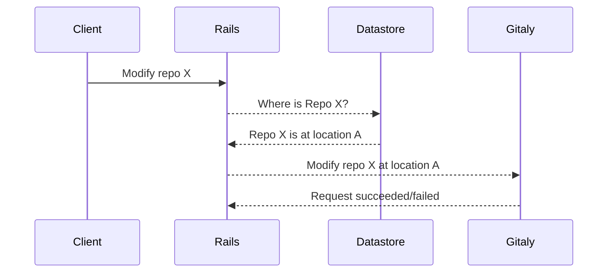
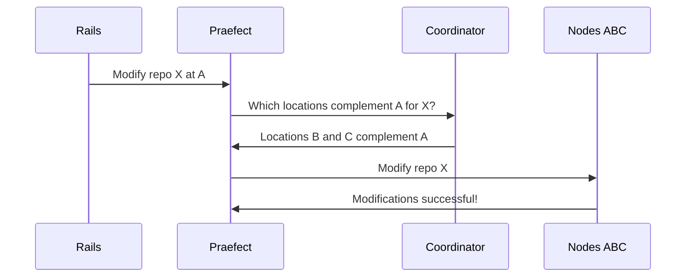
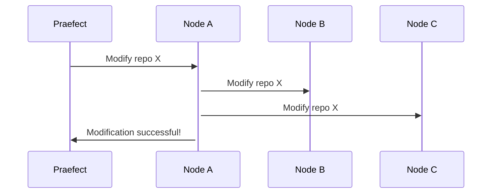
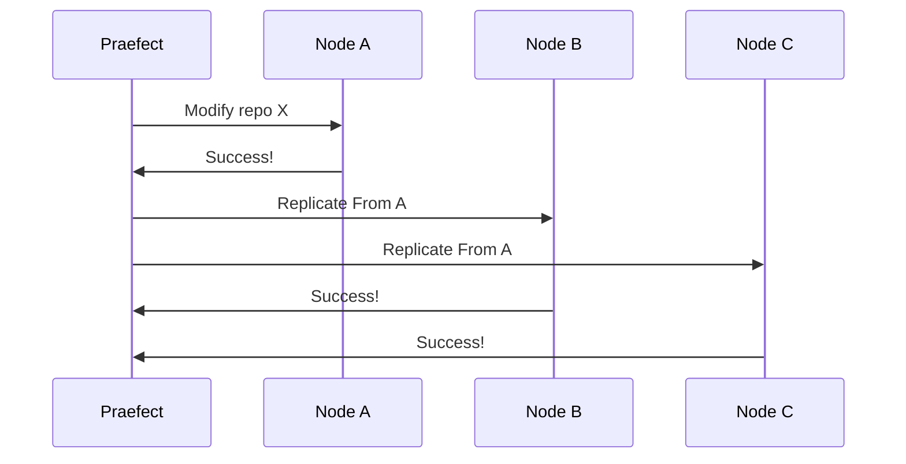
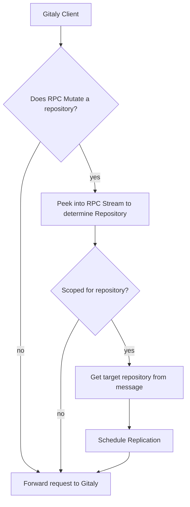
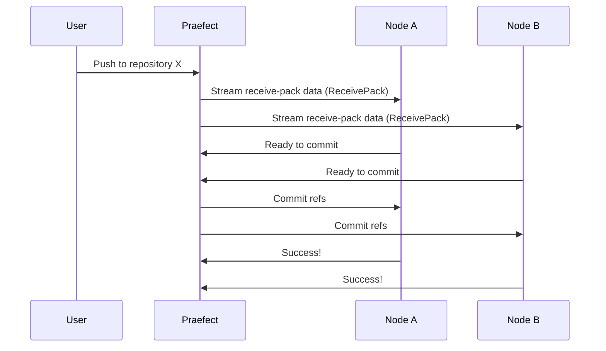
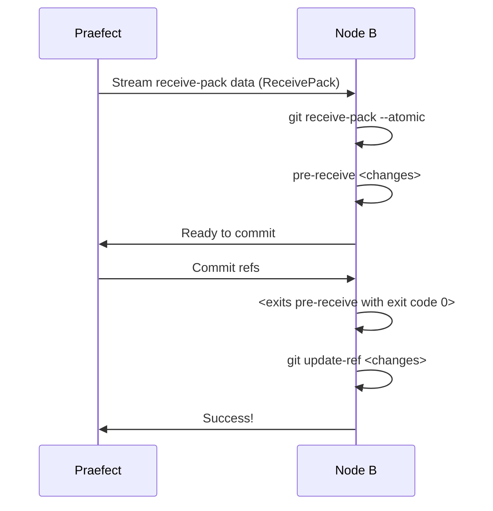

# Gitaly High Availability (HA) Design
Gitaly HA is an active-active cluster configuration for resilient git operations. [Refer to our specific requirements](https://gitlab.com/gitlab-org/gitaly/issues/1332).

Refer to [epic &289][epic] for current issues and discussions revolving around
HA MVC development.

## Terminology
The following terminology may be used within the context of the Gitaly HA project:

- Shard - partition of the storage for all repos. Each shard will require redundancy in the form of multiple Gitaly nodes (at least 3 when optimal) to maintain HA.
- Praefect - a transparent front end to all Gitaly shards. This reverse proxy ensures that all gRPC calls are forwarded to the correct shard by consulting the coordinator. The reverse proxy also ensures that write actions are performed transactionally when needed.
    - etymology: from Latin praefectus for _a person appointed to any of various positions of command, authority, or superintendence, as a chief magistrate in ancient Rome or the chief administrative official of a department of France or Italy._
    - [pronounced _pree-fect_](https://www.youtube.com/watch?v=MHszCZjPmTQ)
- Node (TODO: we probably need a similar latin name here) - performs the actual git read/write operations to/from disk. Has no knowledge of shards/prafects/coordinators just as the Gitaly service existed prior to HA.
- RPC categories (#1496):
    - Accessor - a side effect free (or read-only) RPC; does not modify the git repo (!228)
    - Mutator - an RPC that modifies the data in the git repo (!228)

## Design
The high level design takes a reverse proxy approach to fanning out write requests to the appropriate nodes:


## Phases
An iterative low risk approach needs to be devised to add functionality and verify assumptions at a sustainable pace while not impeding the existing functionality.

### 1. Simple pass-through proxy - no added functionality
- allows us to set up telemetry for observability of new service
- allows us to evaluate a gRPC proxy library

### 2. Introduce State
The following details need to be persisted in Postgres:
- [x] Primary location for a project
- [ ] Redundant locations for a project
- [ ] Available storage locations (initially can be configuration file)

Initially, the state of the shard nodes will be static and loaded from a configuration file. Eventually, this will be made dynamic via a data store (Postgres).

### Resolving Location
The following existing interaction will remain intact for the first iteration of the HA feature:



Once the Rails app has resolved the primary location for the project, the request is made to the praefect. The praefect then resolves the redundant locations via the coordinator before applying the changes.



*Note: the above interaction between the praefect and nodes A-B-C is an all-or-nothing transaction. All nodes must complete in success, otherwise a single node failure will cause the entire transaction to fail. This will be improved when replication is introduced.*

### 3. Replication
The next phase is to enable replication of data between nodes. This makes transactions more efficient and fault tolerant. This could be done a few ways:

#### Node Orchestrated [👎]
Node orchestrated puts the intelligence of replication into one of the nodes being modified:



Orchestration requires designating a leader node for the transaction. This leader node becomes a critical path for all nodes involved. Ideally, we want several simpler (less riskier) operations that can succeed/fail independently of each other. This way, failure and recovery can be handled externally of the nodes.

#### Praefect Orchestrated [👍]
With the praefect orchestrating replication, we are isolating the critical path to a stateless service. Stateless services are preferred for the critical path since another praefect can pick up the task after a praefect failure.



*Note: Once Node-A propagates changes to a peer, Node-A is no longer the critical path for subsequent propagations. If Node-A fails after a second peer is propagated, that second peer can become the new leader and resume replications.*

##### Replication Logic

Here are the steps during a Gitaly client GRPC call intercepted by Praefect:



## Stages until v1.0

Rome wasn't built in a day, nor will Praefect be built in one. To enable for an
iterative approach towards a true HA system, some requirements will not be met
until v1.0. Before that milestone is reached, a beta stage will be worked towards.

The beta stage will consist of only a few building blocks required to iterate
towards the envisioned HA system. The first of those building blocks is creating
and maintaining repository replica's. By maintaining a replica, there's no
requirement for the replica to be up to date right after each mutation on the
repository. Detecting that a repository is mutated, and bringing replicas up to
date in a consistent matter is the primary goal. Implicit in this goal is a way
to perform leader election.

When the beta nears completion further stages will be defined.

## Eventual consistency

The beta implemention above describes an eventually consistent system:
when a repository is modified, the secondaries asynchronously fetch the
changes. This is similar to how Geo works today:

1. A new change is detected.
1. An asynchronous process is queued.
1. A `git fetch` is run to synchronize the latest changes.

The main advantages of this approach:

1. Writes are not delayed by a slow replica
1. This can be implemented today without too much refactoring. This is
   less complex than supporting strong consistency, as we will discuss below.

However, the main disadvantage of this approach is that there are no
consistency guarantees: a replica may be out of sync for seconds,
minutes, or even hours. For busy repositories, this makes it difficult
to offload read queries to the replica, which is especially important
for projects that rely on continuous integration to test the latest
changes.

## Compared to Geo

Despite the similarities above, there are significant differences
between Gitaly HA and Geo:

1. High-availability vs. disaster recovery: These are fundamentally
   different goals. Gitaly HA enables GitLab to function even if a
   single Gitaly node goes down by transparently failing over to a
   secondary Gitaly node.

  From operational perspective Geo is a disaster recovery solution. If
  the primary datacenter goes down, any data stored in GitLab will be
  preserved in another location. Some data loss is acceptable, since
  having a significant amount of data--even if it stale--is better than
  having no data at all. In addition, the Geo-replicated instance can
  take over for the primary with some manual coordination. However, Geo
  does not handle failure of a single Gitaly node.

1. Unlike Geo, strong consistency is most likely a requirement for
   Gitaly HA. Gitaly HA has to be able to fail over to replicas without
   human interaction.

1. Gitaly HA only replicates Git repository data and omits other GitLab
   artifacts (e.g. upload attachments, Git LFS files, CI artifacts, Docker
   containers, etc.).

1. Under the hood, the manner in which Geo and Gitaly HA detect
   repository changes is subtly different but important. For example,
   when a user pushes to a Geo primary instance, the Git post-receive
   handler emits an event (in the form of a database row in PostgreSQL)
   that tells secondaries that the repository has changed. In Gitaly HA,
   Praefect directly handles the RPC that will mutate the repository. This
   architecture makes it possible for Praefect to support strong
   consistency.

### Strong consistency

Strong consistency is desirable for a number of reasons:

1. Minimizes data loss: Strong consistency guarantees that a replica
will never be out of sync with the primary Gitaly node. If a primary
fails with no up-to-date secondaries available, then the latest commits
will be gone. Merge requests may fail to load, CI builds will fail to
fetch references, and users will be upset.

1. Distributed reads: Strong consistency also makes it more likely that
reads can be directed to secondaries. If secondaries take minutes to
sync with the primary, then all reads will have to be directed to the
primary until the secondaries catch up.

1. Faster replication: When implemented properly, it should be possible
to optimize the amount of time and data needed to update secondaries. In
the eventual consistent implementation described above, a `git fetch` is
used to synchronize the secondaries. However, this `git fetch` is a bit
of a blunt tool: the secondaries have to negotiate with the primary what
data it doesn't have, and the primary has to calculate the delta and send
the difference.

However, there are downsides:

1. It will require a significant amount of work to refactor each Gitaly
RPC to support consistent replication.
1. It may be harder to prove correctness.

An eventually consistent model may be "good enough" if replication delay
can be minimized and handled gracefully.

#### Example: Replicating Git pushes

If we assume that all replicas are in sync with the primary, a push to the
primary can be replicated in parallel to many nodes. A consistent
replication approach might look like:



This diagram starts with a user pushing data to GitLab, which is handled
by the Gitaly `ReceivePack` RPC. Let's suppose the user attempts to push
two branches `debug` and `master`. The Git protocol data might look like
the following:

```
   C: 00677d1665144a3a975c05f1f43902ddaf084e784dbe 74730d410fcb6603ace96f1dc55ea6196122532d refs/heads/debug\n
   C: 006874730d410fcb6603ace96f1dc55ea6196122532d 5a3f6be755bbb7deae50065988cbfa1ffa9ab68a refs/heads/master\n
   C: 0000
   C: [PACKDATA]
```

If we assume nodes A and B are in sync, the `ReceivePack` RPC should
first do the following:

1. Check that the `before` SHAs match in both `debug` and `master`. For example,
   `00677d1665144a3a975c05f1f43902ddaf084e784dbe` should be the tip of `debug`.
1. Execute git receive-pack, which then:
   a. Decodes the packfile
   b. Writes the new objects into the Git repository

##### Three-phase commit

To ensure consistency, we can only update the refs for `debug` and
`master` when we are sure that all nodes can perform that operation.
That is why in the diagram above, we need a three-phase commit protocol:
the nodes should only update Git references when Praefect receives
acknowledgement that all nodes are able to update. This update also has
to be done atomically; we either want both `debug` and `master` to be
updated or not at all. This can be done using [Git's `--atomic`
option](https://github.com/git/git/blob/ff66981f4593aec0f3b3eeace0eacb7dbe44fd8c/Documentation/git-push.txt#L210-L213).

How might we make the push wait for Praefect to confirm? One way may be
to use the Git pre-receive hook. Normally, Gitaly uses the pre-receive
hook to make an internal API call to check whether the push should be
allowed to go through. We still need to do that for the primary case, but
we can skip this for the secondaries and simply make a separate Gitaly
RPC to indicate the current transaction is ready to go:



This diagram shows in more detail how Node B performs the three-phase
commit. `git receive-pack` will call the `pre-receive` hook once the Git
data has been received. If Node B is in a good state (i.e. branches are
at the right SHAs), Node B will notify Praefect `Ready to commit`. Once
`Praefect` responds with `Commit refs`, the pre-receive handler will
exit with success code 0, and the reference updates will commence. When
the update finishes with success, the `receive-pack` process should exit
successfully, and `ReceivePack` will respond with a success message.

Note that if the primary node does not receive authorization to commit
the changes, the transaction is aborted. Alternatively, we can check for
authorization before deciding to send the data to all replicas, but this
might slow the push down.

Using Git's `receive-pack` on the nodes with this pre-receive hook
should ensure that the objects sent via the packfile should be stored in
a temporary, quarantined directory until the transaction completes. This
should avoid causing lots of stale, uncommitted objects from being
written to a secondary.

##### Handling failures

What happens if any of the secondaries fail during the replication
attempt? There are several options:

1. Fail the push entirely
1. Commit the transaction if there is a quorum (e.g. 2 of 3 ready to commit)

When a node is out of sync, it needs to be taken out of rotation, and
Praefect has to initiate a repair operation (e.g. `git fetch`, reclone,
delete out-of-sync branches).

#### Example: Replicating merges (`UserMergeBranch` RPC)

As seen in the push case, atomic transactions are crucial for
maintaining consistency. However, like `SSHReceivePack`, there are many
other RPCs that create objects and update references. Suppose a user
merges `develop` into `master`. The `UserMergeBranch` RPC handles the
merge [in the following
way](https://gitlab.com/gitlab-org/gitaly/blob/bb6fc2885c4acfb0bcff11e3b3ea0ce991d191ce/ruby/lib/gitlab/git/repository.rb#L279-284):

1. Create a merge commit that merges `develop` and `master`
2. Update `master` to point to this merge commit

For strong consistency to work, we need to write this merge commit to
all nodes and wait for acknowledgement before step 2 can proceed. Every
RPC that mutates the repository therefore has to be modified to ensure
that a three-phase commit will synchronize changes properly.

One wrinkle here is that some Gitaly RPCs are implemented in Go, and
some are implemented in Ruby via gitaly-ruby. We either have to
implement three-phase commit in both languages or port the remaining
RPCs to Go.

## Notes
* Existing discussions
	* Requirements: https://gitlab.com/gitlab-org/gitaly/issues/1332
	* Design: https://gitlab.com/gitlab-org/gitaly/issues/1335
* Prior art
	* Stemma by Palantir
		* [Announcement](https://medium.com/palantir/stemma-distributed-git-server-70afbca0fc29)
		* Extends jgit (java git implementation)
	* Spokes by GitHub
		* Application layer approach: uses underlying git software to propagate changes to other locations.
	* Bitbucket Data Center (BDC)
		* [BDC FAQ](https://confluence.atlassian.com/enterprise/bitbucket-data-center-faq-776663707.html)
	* Ketch by Google (no longer maintained)
		* [Sid's comment on performance issue](https://news.ycombinator.com/item?id=13934698)
		* Also jgit based
* gRPC proxy considerations
	* [gRPC Proxy library](https://github.com/mwitkow/grpc-proxy)
		* Pros
			* Handles all gRPC requests generically
		* Cons
			* Lack of support
				* [See current importers of project](https://godoc.org/github.com/mwitkow/grpc-proxy/proxy?importers)
			* Low level implementation requires knowledge of gRPC internals
	* Custom code generation
		* Pros
			* Simple and maintainable
			* Allows us to handwrite proxy code and later automate with lessons learned via code generation
		* Cons
			* Process heavy; requires custom tooling
			* Requires a way to tell which methods are read/write
				* [See MR for marking modifying RPCs](https://gitlab.com/gitlab-org/gitaly-proto/merge_requests/228)
	* See also:
		* [nRPC](https://github.com/nats-rpc/nrpc) - gRPC via NATS
		* [grpclb](https://github.com/bsm/grpclb) - gRPC load balancer
* Complications
	* Existing Rails app indicates the Gitaly instance that a request is destined for (e.g. request to modify repo X should be directed to gitaly #1).
		* This means that rails app must be kept in the loop about any changes made to the location of a repo.
		* This may be mitigated by changing the proxy implementation to intepret the destination address as a reference to a shard rather than a specific host. This might open the door to allowing for something like consistent hashing.
    * While Git is distributed in nature, some write operations need to be serialized to avoid race conditions. This includes ref updates.
	* How do we coordinate proxies when applying ref updates? Do we need to?


[epic]: https://gitlab.com/groups/gitlab-org/-/epics/289
