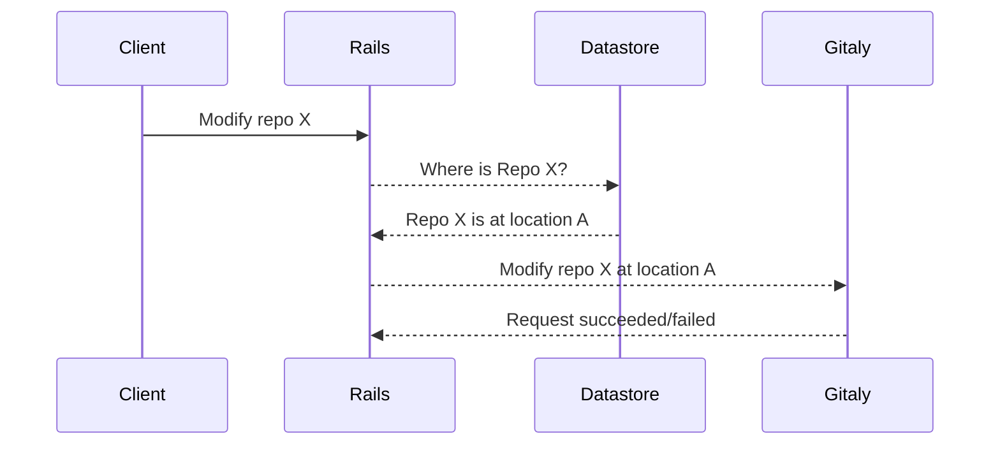
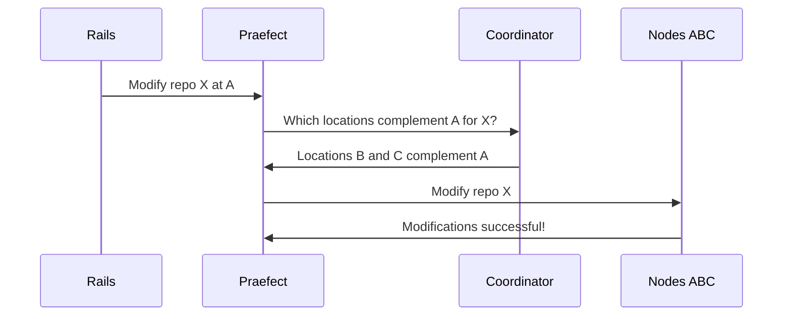
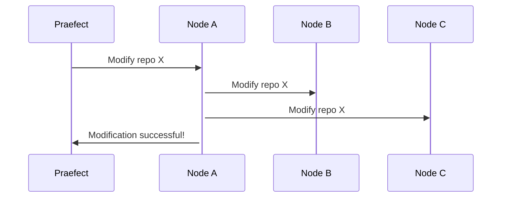
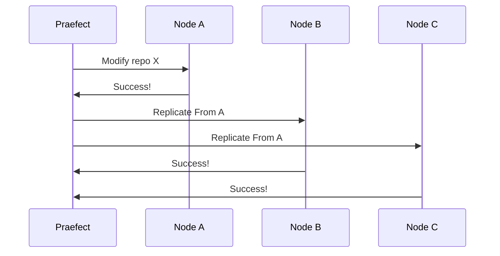
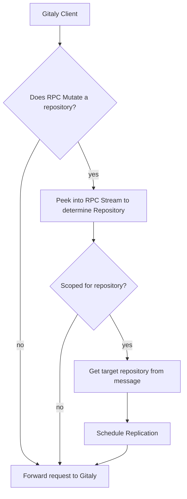

# Gitaly High Availability (HA) Design
Gitaly HA is an active-active cluster configuration for resilient git operations. [Refer to our specific requirements](https://gitlab.com/gitlab-org/gitaly/issues/1332).

Refer to [epic &289][epic] for current issues and discussions revolving around
HA MVC development.

## Terminology
The following terminology may be used within the context of the Gitaly HA project:

- Shard - partition of the storage for all repos. Each shard will require redundancy in the form of multiple Gitaly nodes (at least 3 when optimal) to maintain HA.
- Praefect - a transparent front end to all Gitaly shards. This reverse proxy ensures that all gRPC calls are forwarded to the correct shard by consulting the coordinator. The reverse proxy also ensures that write actions are performed transactionally when needed.
    - etymology: from Latin praefectus for _a person appointed to any of various positions of command, authority, or superintendence, as a chief magistrate in ancient Rome or the chief administrative official of a department of France or Italy._
    - [pronounced _pree-fect_](https://www.youtube.com/watch?v=MHszCZjPmTQ)
- Node (TODO: we probably need a similar latin name here) - performs the actual git read/write operations to/from disk. Has no knowledge of shards/prafects/coordinators just as the Gitaly service existed prior to HA.
- RPC categories (#1496):
    - Accessor - a side effect free (or read-only) RPC; does not modify the git repo (!228)
    - Mutator - an RPC that modifies the data in the git repo (!228)

## Design
The high level design takes a reverse proxy approach to fanning out write requests to the appropriate nodes:

## Phases
An iterative low risk approach needs to be devised to add functionality and verify assumptions at a sustainable pace while not impeding the existing functionality.

### 1. Simple pass-through proxy - no added functionality
- allows us to set up telemetry for observability of new service
- allows us to evaluate a gRPC proxy library

### 2. Introduce State
The following details need to be persisted in Postgres:
- [x] Primary location for a project
- [ ] Redundant locations for a project
- [ ] Available storage locations (initially can be configuration file)

Initially, the state of the shard nodes will be static and loaded from a configuration file. Eventually, this will be made dynamic via a data store (Postgres).

### Resolving Location
The following existing interaction will remain intact for the first iteration of the HA feature:

Once the Rails app has resolved the primary location for the project, the request is made to the praefect. The praefect then resolves the redundant locations via the coordinator before applying the changes.

*Note: the above interaction between the praefect and nodes A-B-C is an all-or-nothing transaction. All nodes must complete in success, otherwise a single node failure will cause the entire transaction to fail. This will be improved when replication is introduced.*

### 3. Replication
The next phase is to enable replication of data between nodes. This makes transactions more efficient and fault tolerant. This could be done a few ways:

#### Node Orchestrated [👎]
Node orchestrated puts the intelligence of replication into one of the nodes being modified:

Orchestration requires designating a leader node for the transaction. This leader node becomes a critical path for all nodes involved. Ideally, we want several simpler (less riskier) operations that can succeed/fail independently of each other. This way, failure and recovery can be handled externally of the nodes.

#### Praefect Orchestrated [👍]
With the praefect orchestrating replication, we are isolating the critical path to a stateless service. Stateless services are preferred for the critical path since another praefect can pick up the task after a praefect failure.

*Note: Once Node-A propagates changes to a peer, Node-A is no longer the critical path for subsequent propagations. If Node-A fails after a second peer is propagated, that second peer can become the new leader and resume replications.*

##### Replication Logic

Here are the steps during a Gitaly client GRPC call intercepted by Praefect:

## Stages until v1.0

Rome wasn't built in a day, nor will Praefect be build in one. To iterate towards
a true HA system some properties will not be met until v1.0. Before that
milestone, an beta stage will worked towards.

The beta stage will consist of only a few required building blocks to iterate
on towards the envisioned HA system. The first of those building blocks is
creating and maintaining repository replica's. By maintaining a replica, there's
no requirement for the replica to be up to date right after each mutation on the
repository. Detecting that a repository is mutated, and bringing replicas up to
date in a consistent matter is the primary goal. Implicit in this goal is a way
to perform leader election.

When the beta nears completion further stages will be defined.

## Notes
* Existing discussions
	* Requirements: https://gitlab.com/gitlab-org/gitaly/issues/1332
	* Design: https://gitlab.com/gitlab-org/gitaly/issues/1335
* Prior art
	* Stemma by Palantir
		* [Announcement](https://medium.com/palantir/stemma-distributed-git-server-70afbca0fc29)
		* Extends jgit (java git implementation)
	* Spokes by GitHub
		* Application layer approach: uses underlying git software to propagate changes to other locations.
	* Bitbucket Data Center (BDC)
		* [BDC FAQ](https://confluence.atlassian.com/enterprise/bitbucket-data-center-faq-776663707.html)
	* Ketch by Google (no longer maintained)
		* [Sid's comment on performance issue](https://news.ycombinator.com/item?id=13934698)
		* Also jgit based
* gRPC proxy considerations
	* [gRPC Proxy library](https://github.com/mwitkow/grpc-proxy)
		* Pros
			* Handles all gRPC requests generically
		* Cons
			* Lack of support
				* [See current importers of project](https://godoc.org/github.com/mwitkow/grpc-proxy/proxy?importers)
			* Low level implementation requires knowledge of gRPC internals
	* Custom code generation
		* Pros
			* Simple and maintainable
			* Allows us to handwrite proxy code and later automate with lessons learned via code generation
		* Cons
			* Process heavy; requires custom tooling
			* Requires a way to tell which methods are read/write
				* [See MR for marking modifying RPCs](https://gitlab.com/gitlab-org/gitaly-proto/merge_requests/228)
	* See also:
		* [nRPC](https://github.com/nats-rpc/nrpc) - gRPC via NATS
		* [grpclb](https://github.com/bsm/grpclb) - gRPC load balancer
* Complications
	* Existing Rails app indicates the Gitaly instance that a request is destined for (e.g. request to modify repo X should be directed to gitaly #1).
		* This means that rails app must be kept in the loop about any changes made to the location of a repo.
		* This may be mitigated by changing the proxy implementation to intepret the destination address as a reference to a shard rather than a specific host. This might open the door to allowing for something like consistent hashing.
    * While Git is distributed in nature, some write operations need to be serialized to avoid race conditions. This includes ref updates.
	* How do we coordinate proxies when applying ref updates? Do we need to?

[epic]: https://gitlab.com/groups/gitlab-org/-/epics/289
