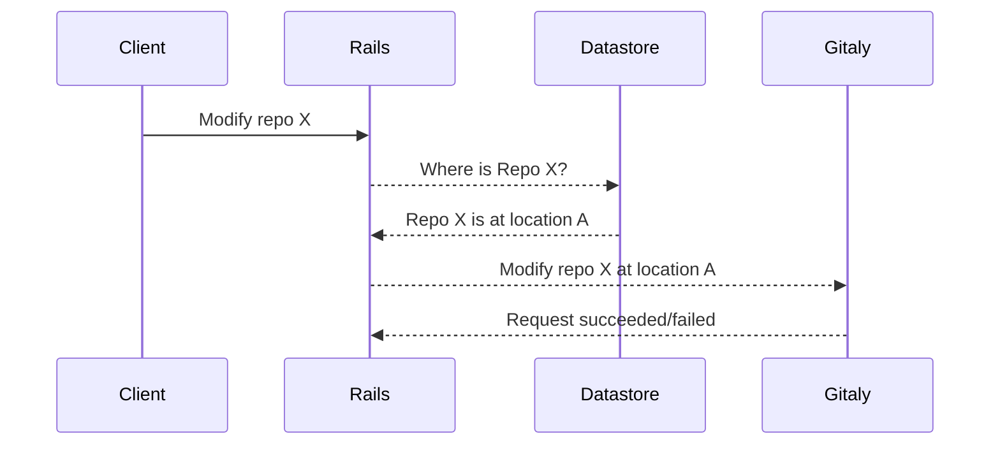
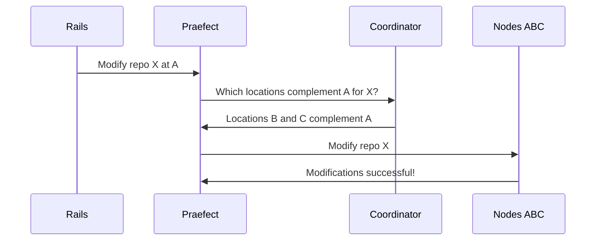
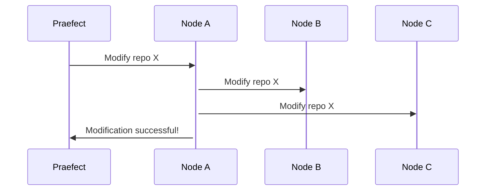
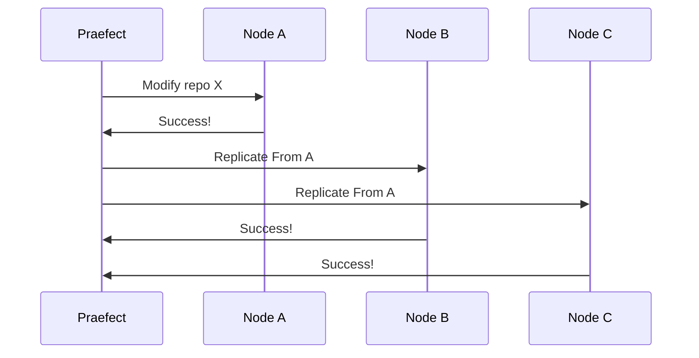
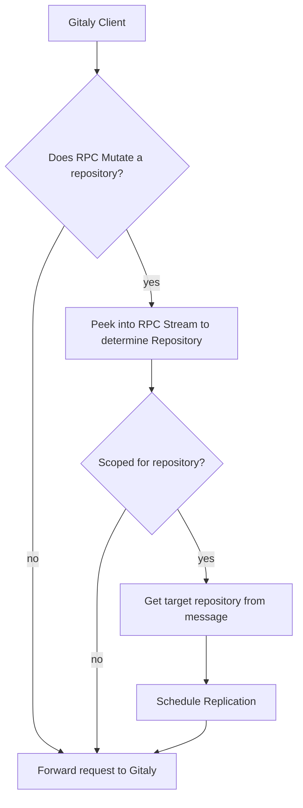
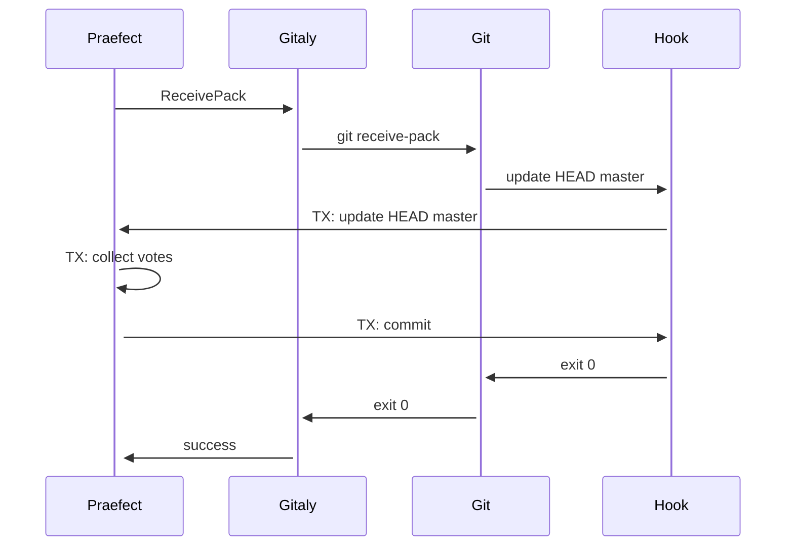
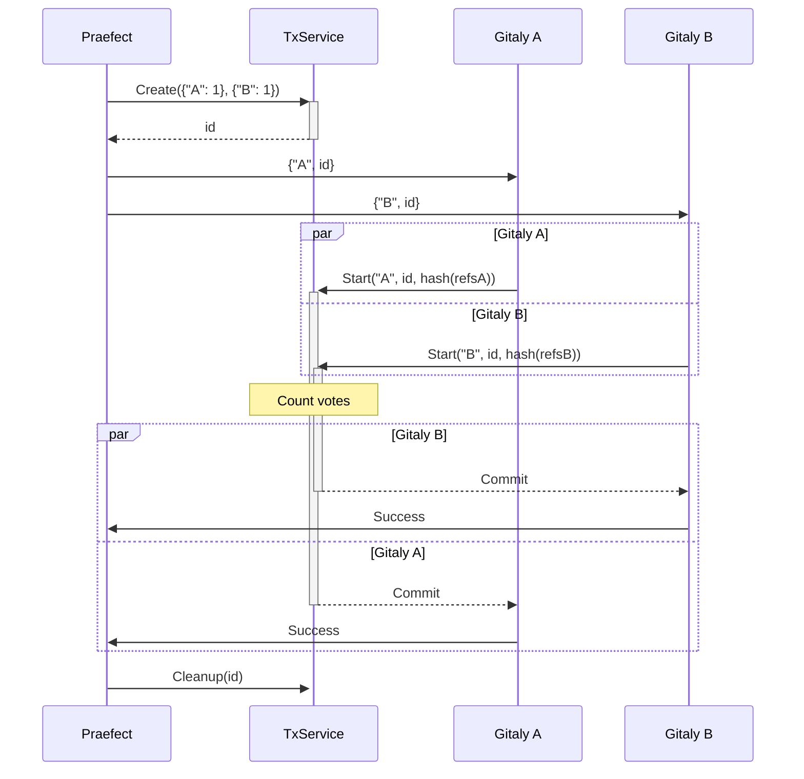

# Gitaly High Availability (HA) Design
Gitaly Cluster is an active-active cluster configuration for resilient git operations. [Refer to our specific requirements](https://gitlab.com/gitlab-org/gitaly/issues/1332).

Refer to [epic &289][epic] for current issues and discussions revolving around
HA MVC development.

## Terminology
The following terminology may be used within the context of the Gitaly Cluster project:

- Shard - partition of the storage for all repos. Each shard will require redundancy in the form of multiple Gitaly nodes (at least 3 when optimal) to maintain HA.
- Praefect - a transparent front end to all Gitaly shards. This reverse proxy ensures that all gRPC calls are forwarded to the correct shard by consulting the coordinator. The reverse proxy also ensures that write actions are performed transactionally when needed.
    - etymology: from Latin praefectus for _a person appointed to any of various positions of command, authority, or superintendence, as a chief magistrate in ancient Rome or the chief administrative official of a department of France or Italy._
    - [pronounced _pree-fect_](https://www.youtube.com/watch?v=MHszCZjPmTQ)
- Node (TODO: we probably need a similar latin name here) - performs the actual git read/write operations to/from disk. Has no knowledge of shards/prafects/coordinators just as the Gitaly service existed prior to HA.
- RPC categories (#1496):
    - Accessor - a side effect free (or read-only) RPC; does not modify the git repo (!228)
    - Mutator - an RPC that modifies the data in the git repo (!228)

## Design
The high level design takes a reverse proxy approach to fanning out write requests to the appropriate nodes:

## Phases
An iterative low risk approach needs to be devised to add functionality and verify assumptions at a sustainable pace while not impeding the existing functionality.

### 1. Simple pass-through proxy - no added functionality
- allows us to set up telemetry for observability of new service
- allows us to evaluate a gRPC proxy library

### 2. Introduce State
The following details need to be persisted in Postgres:
- [x] Primary location for a project
- [ ] Redundant locations for a project
- [ ] Available storage locations (initially can be configuration file)

Initially, the state of the shard nodes will be static and loaded from a configuration file. Eventually, this will be made dynamic via a data store (Postgres).

### Resolving Location
The following existing interaction will remain intact for the first iteration of the HA feature:

Once the Rails app has resolved the primary location for the project, the request is made to the praefect. The praefect then resolves the redundant locations via the coordinator before applying the changes.

*Note: the above interaction between the praefect and nodes A-B-C is an all-or-nothing transaction. All nodes must complete in success, otherwise a single node failure will cause the entire transaction to fail. This will be improved when replication is introduced.*

### 3. Replication
The next phase is to enable replication of data between nodes. This makes transactions more efficient and fault tolerant. This could be done a few ways:

#### Node Orchestrated [👎]
Node orchestrated puts the intelligence of replication into one of the nodes being modified:

Orchestration requires designating a leader node for the transaction. This leader node becomes a critical path for all nodes involved. Ideally, we want several simpler (less riskier) operations that can succeed/fail independently of each other. This way, failure and recovery can be handled externally of the nodes.

#### Praefect Orchestrated [👍]
With the praefect orchestrating replication, we are isolating the critical path to a stateless service. Stateless services are preferred for the critical path since another praefect can pick up the task after a praefect failure.

*Note: Once Node-A propagates changes to a peer, Node-A is no longer the critical path for subsequent propagations. If Node-A fails after a second peer is propagated, that second peer can become the new leader and resume replications.*

##### Replication Logic

Here are the steps during a Gitaly client GRPC call intercepted by Praefect:

## Stages until v1.0

Rome wasn't built in a day, nor will Praefect be built in one. To enable for an
iterative approach towards a true HA system, some requirements will not be met
until v1.0. Before that milestone is reached, a beta stage will be worked towards.

The beta stage will consist of only a few building blocks required to iterate
towards the envisioned HA system. The first of those building blocks is creating
and maintaining repository replica's. By maintaining a replica, there's no
requirement for the replica to be up to date right after each mutation on the
repository. Detecting that a repository is mutated, and bringing replicas up to
date in a consistent matter is the primary goal. Implicit in this goal is a way
to perform leader election.

When the beta nears completion further stages will be defined.

## Eventual consistency

The beta implemention above describes an eventually consistent system:
when a repository is modified, the secondaries asynchronously fetch the
changes. This is similar to how Geo works today:

1. A new change is detected.
1. An asynchronous process is queued.
1. A `git fetch` is run to synchronize the latest changes.

The main advantages of this approach:

1. Writes are not delayed by a slow replica
1. This can be implemented today without too much refactoring. This is
   less complex than supporting strong consistency, as we will discuss below.

However, the main disadvantage of this approach is that there are no
consistency guarantees: a replica may be out of sync for seconds,
minutes, or even hours. For busy repositories, this makes it difficult
to offload read queries to the replica, which is especially important
for projects that rely on continuous integration to test the latest
changes.

### Failover

Depending on the configured strategy, there are a few ways of handling a failure of a Primary
Gitaly node:

1. Strategies:
    1. Failover disabled
    1. Local elector
    1. SQL elector
1. Read-only mode

#### Failover Disabled

When failover is disabled, nothing will be done about the primary failure. The virtual storage
is inaccessible until the configured primary node is back online.

#### Local Elector

Local election tries to promote another Gitaly node as the new primary. It simply picks the next
node from the list of healthy secondaries of the failed primary. There is no synchronization between
different Praefect nodes thus this strategy is mostly useful for local development. If no healthy secondary
exists to serve as the new primary, the virtual storage will be inaccessible.

#### SQL Elector

SQL elector stores each Praefect's view of the Gitaly nodes' health in Postgres. When a primary fails, SQL
elector promotes a secondary that the majority of Praefect nodes consider healthy as the new primary. When
choosing the new primary, it also prioritizes a secondary that has the least failed replication jobs to minimize
data loss. If there is no eligible candidate for a promotion, the virtual storage will be inaccessible.

#### Read-only Mode

A virtual storage is marked as read-only after failing over to a new primary. The main reason
for this is to avoid conflicts between the new and the old primary. If there were outstanding replication jobs
towards the new primary at the time of the failover, it would be missing some data as it wasn't able to replicate
it from the old primary before the failover. Read-only mode prevents the new primary from accepting writes that
would potentially conflict with the unreplicated writes on the old primary. This allows an administrator to
solve data loss cases by synchronizing the missing data from the old primary to the new one if they so choose.
Alternatively, an administrator can choose to enable writes on the new primary immediately if they do not wish
to solve the data loss cases.

## Compared to Geo

Despite the similarities above, there are significant differences
between Gitaly Cluster and Geo:

1. High-availability vs. disaster recovery: These are fundamentally
   different goals. Gitaly Cluster enables GitLab to function even if a
   single Gitaly node goes down by transparently failing over to a
   secondary Gitaly node.

  From operational perspective Geo is a disaster recovery solution. If
  the primary datacenter goes down, any data stored in GitLab will be
  preserved in another location. Some data loss is acceptable, since
  having a significant amount of data--even if it stale--is better than
  having no data at all. In addition, the Geo-replicated instance can
  take over for the primary with some manual coordination. However, Geo
  does not handle failure of a single Gitaly node.

1. Unlike Geo, strong consistency is most likely a requirement for
   Gitaly Cluster. Gitaly Cluster has to be able to fail over to replicas without
   human interaction.

1. Gitaly Cluster only replicates Git repository data and omits other GitLab
   artifacts (e.g. upload attachments, Git LFS files, CI artifacts, Docker
   containers, etc.).

1. Under the hood, the manner in which Geo and Gitaly Cluster detect
   repository changes is subtly different but important. For example,
   when a user pushes to a Geo primary instance, the Git post-receive
   handler emits an event (in the form of a database row in PostgreSQL)
   that tells secondaries that the repository has changed. In Gitaly Cluster,
   Praefect directly handles the RPC that will mutate the repository. This
   architecture makes it possible for Praefect to support strong
   consistency.

## Strong Consistency Design

When doing updates in a Git repository, we want to assure that all Gitaly nodes
in a high-availability setup have the same references afterwards. Historically,
this was accomplished by using NFS as a Gitaly storage backend, but due to
various reasons we have been deprecating this setup in favor of Praefect.

Praefect allows to have multiple Gitaly nodes with individual storage backends.
In order to achieve consistency across these nodes, Praefect inspects incoming
requests and, depending on the request's nature, may decide to replicate these
changes after they have been performed on the primary Gitaly node. This model
guarantees eventual consistency, but there is always at least a brief moment
where the Gitaly nodes will disagree on what the current state is.

To lift this limitation, the next iteration of Praefect's design is to achieve strong
consistency: given a mutating request, all Gitaly nodes should agree to make the
modification before actually persisting it to disk. This document describes the
design for this.

### Reference Updates

While server-side Git repositories can be mutated in a lot of ways, all
user-visible mutations involve updates to one or multiple references. For the
sake of simplicity, we can thus reduce the problem scope to ensure strong
consistency for reference updates, only. There are multiple paths in GitLab that
can trigger such a reference update, including but not limited to:

- Clients execute git-push(1).

- Creation of tags via GitLab's `UserCreateTag` RPC.

- Merges and rebases when accepting merge requests.

Common to all of them is that they perform reference updates using git-core,
and, more importantly, its reference transaction mechanism. An ideal solution
would thus hook into this reference transaction mechanism directly via
githooks(5), which has been implemented in git-core and is going to be part of
release v2.28.0.

As a first iteration, we will approximate hooking into the reference transaction
mechanism by instead implementing strong consistency via the pre-receive hook.
This hook gets executed whenever a client pushes to a repository. While this
will not cover all the different ways a reference may be update,  it can be used
as a proof of concept to establish whether strong consistency via hooks is a
viable route to go.

### Strong Consistency via Pre-Receive Hooks

The following diagram shows the flow of a ReceivePack operation from Praefect
via Gitaly to Git and finally to the pre-receive hook:

1. Praefect will proxy an incoming `ReceivePack` request to multiple Gitaly
   nodes.
1. Gitaly executes `git receive-pack` and passes incoming data to it.
1. After `git receive-pack` has received all references that are to be updated,
   it executes the pre-receive hook and writes all references that are to be
   updated to its standard input.
1. The pre-receive hook reaches out to Praefect and notifies it about all the
   reference updates it wants to perform.
1. Praefect waits until all Gitaly nodes have notified it about the reference
   update. After it has received all notifications, it verifies that all nodes
   want to perform the same update. If so, it notifies them that they may go
   ahead by sending a "commit" message. Otherwise, it will send an "abort"
   message.
1. When receiving the response, the hook will either return an error in case it
   got an "abort" message, which will instruct Git to not update the references.
   Otherwise, the hook will exit successfully and Git will proceed.
1. Gitaly returns success to Praefect and the transaction is done.

#### Data Channel between Praefect and Hook

While it would be possible to proxy transaction information via Gitaly, this
would require us to update the complete callchain between Praefect and Git hook.
Additionally, it would require us to update all call-sites where a reference
could potentially be updated. Because of this, it was decided to circumvent
Gitaly and have the Git hook talk directly to Praefect.

As Gitaly did not previously know how to connect to Praefect, Git hooks didn't
either. To fix this, Praefect started passing along a gRPC metadata header along
to Gitaly that includes both the listening address as well as the token required
to authenticate. If a request is proxied by Praefect, then Gitaly will know to
extract the connection information and make it available to hooks by exposing it
in an environment variable.

#### Transaction Service

To let Praefect know about reference transactions, the
[transaction service](https://gitlab.com/gitlab-org/gitaly/-/blob/master/proto/transaction.proto)
was implemented. The service has a single RPC `VoteTransaction` to vote on a
transaction created by Praefect.

Each transaction gets the following information at creation time:

- Each transaction is identified by a transaction identifier, which is simply an
  integer that gets randomly generated by the transaction service when `Create`
  is called and is returned to the caller. Both `Start` and `Cleanup` requests
  are required to pass along this identifier. This identifier generated at
  random in contrast to being a sequence counter to avoid collisions.

- Each transaction has a fixed set of voters allowed to take part in the
  transaction. Each voter has a name (which needs to be unique and is typically
  the Gitaly storage name) as well as a number of votes it has. The number of
  votes needs to be in the range of `[0,MAX_UINT32]`. The total number of votes
  must be non-zero.

- Each transaction has a threshold, which indicates how many votes are required
  to be cast for the same item in order to commit the transaction. The threshold
  needs to be in the range of `[ceil((total_votes+1)/2),total_votes)` to
  guarantee that each transaction can have a single outcome, only, and that an
  outcome can be reached.

When casting a vote, each voter supplies the transaction identifier as well as
its own name to uniquely identify itself as well as the transaction.
Furthermore, the voter needs to let the transaction service know which
references it wants to update. Given that a transaction may update thousands of
references at once, it was deemed wasteful to pass the list of all reference
updates to the transaction service. Instead, all queued reference updates are
hashed, where the hash is the item that is then voted on.

The typical lifetime of a given transaction will then look like following:

#### Voting Strategies

Given the combination of vote counts and threshold, one can implement different
voting strategies, which allows making a tradeoff between performance and
consistency:

- Strong: All voters have a vote count of `1` and the threshold equals the
  number of voters. As a result, all Gitaly nodes will have to agree before
  committing anything.

- Allowed failures: Voters have a vote count of `1` and the threshold is
  decreased to allow for failures of a subset of nodes. E.g. it could be
  `len(nodes)-1` to allow a single Gitaly node to fail.

- Primary wins: The primary gets a vote count of `1` while secondaries get a
  vote count of `0` with a threshold of `1`. As a result, transactions will
  always get committed. This resembles our "Eventual Consistency" implementation
  but with benefit that we need to schedule replication jobs only for the subset
  of nodes that failed for a given transaction.

- Primary mandatory: The primary gets a vote count of `len(secondaries)+1`,
  while each secondary gets a vote count of `1` with a threshold of
  `len(secondaries)+1+n`, where `n` dictates how many nodes need to agree the
  primary. This strategy makes it mandatory that the primary agrees on the
  outcome, but also that at least `n` secondaries agree with the primary.

At the point of writing, Praefect sets up transactions with a "Strong" voting
strategy.

#### Handling failures

In case the voting strategy failed to determine a winner, the transaction needs
to be aborted and no node must commit the updated reference. In this case,
replication jobs should be scheduled to repair nodes and arrive at a consistent
state again, if at all possible. If it is not possible to determine an
up-to-date node that may act as the replication job source, the cluster needs to be
put into read-only-mode.

In case the voting strategy determines a winner but there are failed nodes, a
replication job needs to be scheduled for any of the winning nodes to all of the
failed nodes to repair them.

An edge case is when a transaction was registered, but none of the voters showed
up at all. The root cause for this can be many, e.g. no references were modified
or that the executed command simply wasn't aware of transactions. As it is
impossible to determine the root cause, replication jobs from primary to
secondaries needs to be created unconditionally to replicate any potential
changes.

## Enabling Strong Consistency

The current implementation of strong consistency via pre-receive hooks is
guarded by feature flags. In order to make use of it, you thus need to enable
the following feature flag:

- `gitaly_reference_transactions`: Enables usage of reference transactions and
  proxying to multiple Gitaly nodes at once for both SSH and HTTPS receive-pack
  endpoints.

In order to observe reference transactions, two metrics
`gitaly_praefect_transactions_total` and
`gitaly_praefect_transactions_delay_seconds` are exposed.

**Note:** Required work is only present in Gitaly starting with release
v13.1.0-rc3.

## Notes
* Existing discussions
	* Requirements: https://gitlab.com/gitlab-org/gitaly/issues/1332
	* Design: https://gitlab.com/gitlab-org/gitaly/issues/1335
* Prior art
	* Stemma by Palantir
		* [Announcement](https://medium.com/palantir/stemma-distributed-git-server-70afbca0fc29)
		* Extends jgit (java git implementation)
	* Spokes by GitHub
		* Application layer approach: uses underlying git software to propagate changes to other locations.
	* Bitbucket Data Center (BDC)
		* [BDC FAQ](https://confluence.atlassian.com/enterprise/bitbucket-data-center-faq-776663707.html)
	* Ketch by Google (no longer maintained)
		* [Sid's comment on performance issue](https://news.ycombinator.com/item?id=13934698)
		* Also jgit based
* gRPC proxy considerations
	* [gRPC Proxy library](https://github.com/mwitkow/grpc-proxy)
		* Pros
			* Handles all gRPC requests generically
		* Cons
			* Lack of support
				* [See current importers of project](https://godoc.org/github.com/mwitkow/grpc-proxy/proxy?importers)
			* Low level implementation requires knowledge of gRPC internals
	* Custom code generation
		* Pros
			* Simple and maintainable
			* Allows us to handwrite proxy code and later automate with lessons learned via code generation
		* Cons
			* Process heavy; requires custom tooling
			* Requires a way to tell which methods are read/write
				* [See MR for marking modifying RPCs](https://gitlab.com/gitlab-org/gitaly-proto/merge_requests/228)
	* See also:
		* [nRPC](https://github.com/nats-rpc/nrpc) - gRPC via NATS
		* [grpclb](https://github.com/bsm/grpclb) - gRPC load balancer
* Complications
	* Existing Rails app indicates the Gitaly instance that a request is destined for (e.g. request to modify repo X should be directed to gitaly #1).
		* This means that rails app must be kept in the loop about any changes made to the location of a repo.
		* This may be mitigated by changing the proxy implementation to intepret the destination address as a reference to a shard rather than a specific host. This might open the door to allowing for something like consistent hashing.
    * While Git is distributed in nature, some write operations need to be serialized to avoid race conditions. This includes ref updates.
	* How do we coordinate proxies when applying ref updates? Do we need to?

[epic]: https://gitlab.com/groups/gitlab-org/-/epics/289
