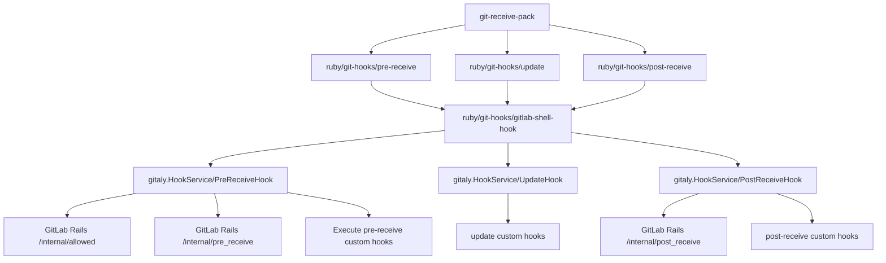
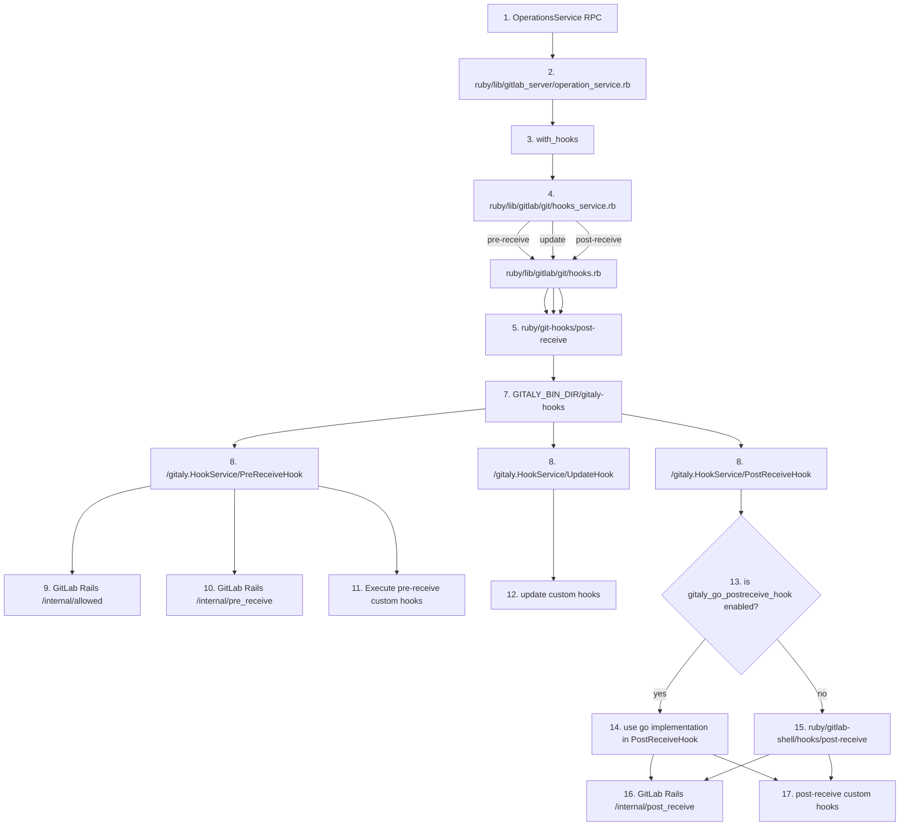

# Gitaly Hooks

Gitaly requires Git to execute hooks after certain mutator RPCs. This document
explains the different code paths that trigger hooks.

# git-receive-pack

When git-receive-pack gets called either through `PostReceivePack` or `SSHReceivePack`, git will look for hooks in `core.hooksPath`. See the [githooks documentation](https://git-scm.com/docs/githooks)
for detailed information about how git calls hooks. `core.hooksPath` is set to an internal directory containing Gitaly hooks detailed below.

## Gitaly server hooks

When `git-receive-pack` is called, the following server side hooks run:

`pre-receive`: checks if the ref updates are allowed to happen, and increments the reference counter.
If reference transactions are enabled, the hook's standard input containing all reference updates will be hashed and submitted as a vote.

`update`: on GitLab.com this is a noop. It simply runs the update custom hooks. Custom hooks are detailed below

`post-receive`: prints out the merge request link, and decreases the reference counter.

Note: The reference counter is a counter per repository so GitLab knows when a certain repository can be moved. If the reference
counter is not at 0, that means there are active pushes happening.

## Custom Hooks

After each hook type `pre-receive`, `update`, `post-receive`, custom hooks are also run.
See the [GitLab Server Hooks documentation](https://docs.gitlab.com/ee/administration/server_hooks.html) for how they are used.

### Execution path

A Brief History: Gitaly hooks were originally in GitLab-Shell and implemented in Ruby. They have since been moved to Gitaly, and are replaced
with hooks implemented in Go.

1. `git-receive-pack` calls `pre-receive`, `update`, `post-receive` shell scripts under `ruby/git-hooks/`. Each of these scripts simply invokes `exec $GITALY_BIN_DIR/git-hooks` with the hook name and arguments.
1. `gitaly-hooks` will call the corresponding RPC that handles `pre-receive`(`PreReceiveHook`), `update`(`UpdateHook`), and `post-receive`(`PostReceiveHook`).
    - `/gitaly.HookService/UpdateHook` will run once for each ref being updated.
1. `PreReceiveHook` RPC will call out to GitLab's `internal/allowed` endpoint.
1. `PreReceiveHook` RPC will call out to GitLab's `internal/pre_receive` endpoint.
1. `PreReceiveHook` RPC will find `pre-receive` custom hooks and execute them.
1. `UpdateHook` RPC will find `update` custom hooks and execute them.
1. `PostReceiveHook` will call out to GitLab's `internal/post_receive` endpoint.
1. `PostReceiveHook` will call the `post-receive` custom hooks.

# Operations RPCs

The other way that Gitaly hooks are triggered is through the Operations Service RPCs. Similar to `git-receive-pack`, the `pre-receive`, `update`, and `post-receive` are executed when a ref is updated via
one of the Operations Service RPCs. The execution path is different. Instead of `git-receive-pack` triggering the hooks, they are invoked manually
through Gitaly.

### Execution path

1. An OperationsService RPC calls out to `gitaly-ruby`'s `operation_service.rb`.
1. A number of operation service methods call out to the `with_hooks` method.
1. `with_hooks` calls out to `hooks_service.rb`.
1. `hooks_service.rb` calls `hooks.rb` with `pre-receive`, `update`, and `post-receive`.
1. `pre-receive`, `update`, `post-receive` shell scripts call `gitlab-shell-hook` shell script with environment, hook name, hook arguments.

    Note: Steps 6-17 are identical to descriptions of steps 2-13 above.

1. Each of these scripts simply calls `ruby/git-hooks/gitlab-shell-hook` with the environment, stdin, hook name, and hook arguments.
1. `ruby/git-hooks/gitlab-shell-hook` in turn calls the `GITALY_BIN_DIR/gitaly-hooks` binary.
1. `gitaly-hooks` will call the corresponding RPC that handles `pre-receive`(`PreReceiveHook`), `update`(`UpdateHook`), and `post-receive`(`PostReceiveHook`).
    - `/gitaly.HookService/PreReceiveHook` and `/gitaly.HookService/UpdateHoo` uses the Go implementation by default but falls back to the Ruby `ruby/gitlab-shell/pre-receive` and  `ruby/gitlab-shell/update` hooks when `:gitaly_go_prereceive_hook`, `:gitaly_go_update_hook`
      feature flags are (respectively) explicitly disabled.
    - `/gitaly.HookService/UpdateHook` will run once for each ref being updated.
1. `PreReceiveHook` RPC will call out to GitLab's `internal/allowed` endpoint.
1. `PreReceiveHook` RPC will call out to GitLab's `internal/pre_receive` endpoint. (uses the Go implementation by default but falls back to the Ruby `ruby/gitlab-shell/pre-receive` hook when `:gitaly_go_prereceive_hook` is explicitly disabled)
1. `PreReceiveHook` RPC will find `pre-receive` custom hooks and execute them.
1. `UpdateHook` RPC will find `update` custom hooks and execute them.
1. `PostReceiveHook`  will check if `gitaly_go_postreceive_hook` feature flag is enabled.
1. If `gitaly_go_postreceive_hook`  is not enabled, `PostReceiveHook` RPC will fall back to calling the Ruby hook.
1. If `gitaly_go_postreceive_hook` is enabled,  `PostReceiveHook` RPC will use the go implementation.
1. Both the Ruby `post-receive` hook as well as the Go implementation of `PostReceiveHook` will call out to GitLab's `internal/post_receive` endpoint. (the `internal/post_receive` endpoint decreases the reference counter, and generates the MR creation link that gets printed out to stdout.)
1. Both the Ruby `post-receive` hook as well as the Go implementation of `PostReceiveHook` will call the `post-receive` custom hooks.
